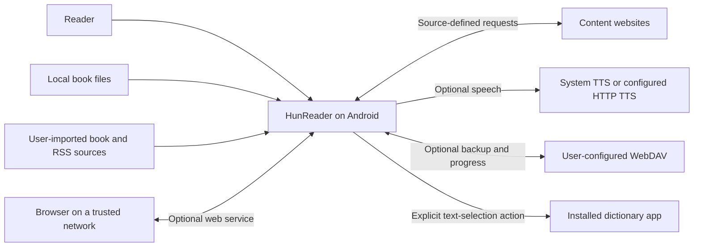
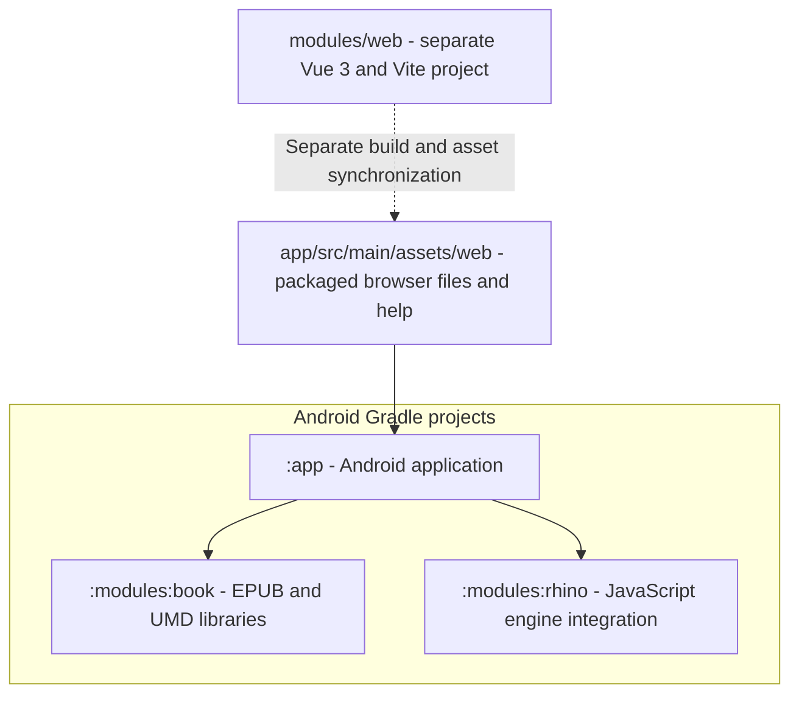
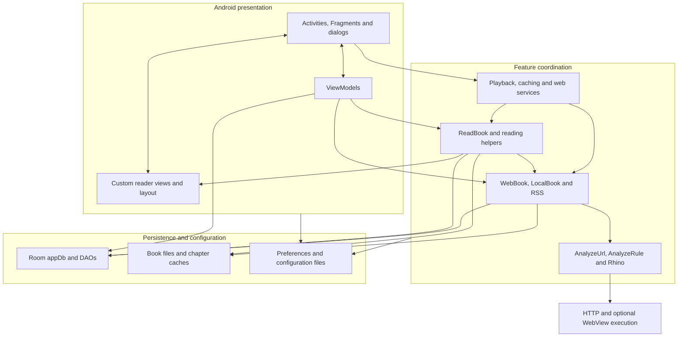
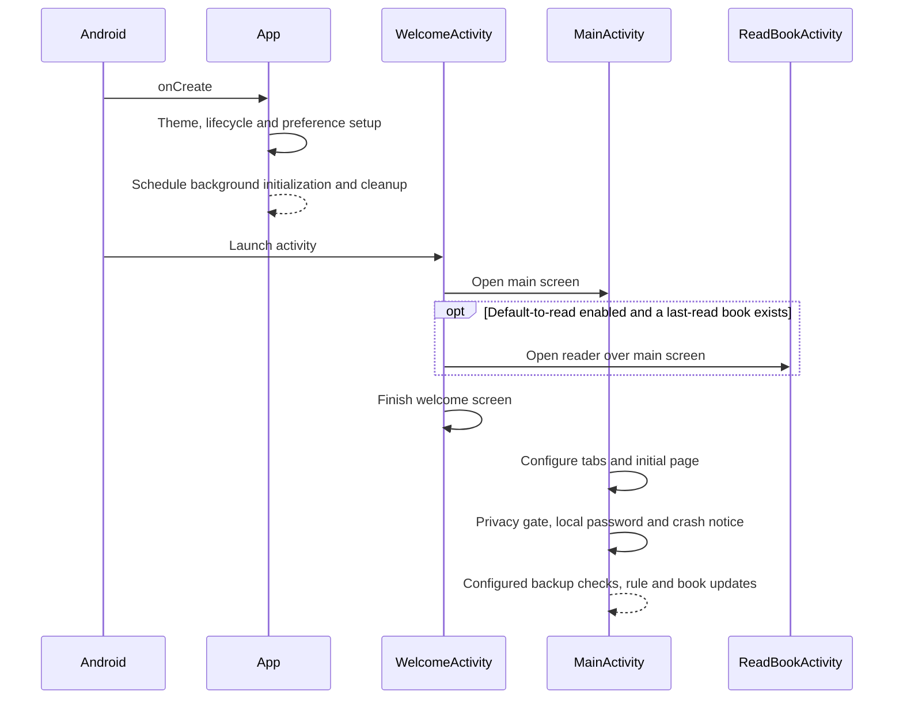

# HunReader architecture and learning guide

Start here to understand the application before reading individual classes.
This describes the implementation in this checkout, reviewed on 2026-10-06,
not a proposed redesign or a guarantee about upstream Legado.

## Reading route

| Step | Guide | What you will understand |
| --- | --- | --- |
| 1 | This overview | Product, build modules, runtime components, startup and navigation |
| 2 | [Content sources](content-sources.md) | Source rules, search, book details, chapters and local file parsing |
| 3 | [Reader](reader.md) | Loading, pagination, rendering, gestures and dictionary handoff |
| 4 | [Data and sync](data-and-sync.md) | Room, files, preferences, reading progress, backup and WebDAV |
| 5 | [Integrations](integrations.md) | Read-aloud, other media, RSS and the optional browser interface |

Each guide contains Mermaid diagrams, implementation entry points and a small
code-reading exercise. Component diagrams use Mermaid flowcharts with grouped
boxes. Arrows show the main dependencies or data flow, not every method call.
Sequence diagrams describe representative paths; optional branches are labeled.

## 1. What is this application?

HunReader is a personal Android e-reader fork of Legado-E, which is based on
Legado. Think of it as **a configurable reading client, not a hosted bookstore**:
it reads local files and retrieves remote content using sources the user supplies.

The fork keeps reading, source parsing, media and optional networking, but removes
upstream updates, Firebase integration and bundled online-service presets.
Book/RSS sources and HTTP TTS configurations must be added by the user. Offline
chapter rules, reading layouts, themes and keyboard helpers remain.

The installation IDs are `io.github.hunterxue.hunreader` and its `.debug` variant;
the Kotlin/Java namespace is still `io.legado.app`. These are different concepts.
See the [project policy](../README.md) for the authoritative fork-specific list.

## 2. Main features and where they live

The main screen has Bookshelf, Explore, RSS and My/settings destinations.
Visibility and bookshelf presentation are configurable. Search, book details,
the reader and management screens are separate screens, not additional main tabs.

| Feature | Responsibility | Start reading |
| --- | --- | --- |
| Bookshelf | Saved books, groups, progress and chapter updates | [bookshelf UI](../app/src/main/java/io/legado/app/ui/main/bookshelf), [MainViewModel](../app/src/main/java/io/legado/app/ui/main/MainViewModel.kt) |
| Search and Explore | Search enabled sources or browse source-defined categories | [search UI](../app/src/main/java/io/legado/app/ui/book/search), [Explore UI](../app/src/main/java/io/legado/app/ui/main/explore) |
| Source management | Import, edit, test and update configurable source rules | [book source UI](../app/src/main/java/io/legado/app/ui/book/source), [association/import UI](../app/src/main/java/io/legado/app/ui/association) |
| Local books | Import files and parse their metadata, contents and chapters | [LocalBook](../app/src/main/java/io/legado/app/model/localBook/LocalBook.kt) |
| Text reading | Layout, themes, fonts, navigation, selection, bookmarks and replacement rules | [reader UI](../app/src/main/java/io/legado/app/ui/book/read) |
| Manga and media | Image reading, source-provided audio/video and text-to-speech | [ReadManga](../app/src/main/java/io/legado/app/model/ReadManga.kt), [services](../app/src/main/java/io/legado/app/service) |
| RSS | Subscription articles, content rules, reading and saved articles | [RSS UI](../app/src/main/java/io/legado/app/ui/rss), [RSS model](../app/src/main/java/io/legado/app/model/rss) |
| Data management | Backup/restore, WebDAV and reading progress | [storage helpers](../app/src/main/java/io/legado/app/help/storage), [AppWebDav](../app/src/main/java/io/legado/app/help/AppWebDav.kt) |
| Browser interface | Optional web bookshelf, source editing and debugging | [web server](../app/src/main/java/io/legado/app/web), [web client](../modules/web) |

## 3. Build modules are not feature modules

[Gradle settings](../settings.gradle) includes three Android projects. Most
features are packages inside the application, not independently built modules.

- [Application build](../app/build.gradle): Android Views/XML with ViewBinding,
  Kotlin/JVM 17, Room/KSP, coroutines, HTTP clients and media dependencies.
  This is not a Compose application.
- [Book library](../modules/book): EPUB and UMD support; the application's
  local-book layer also handles other formats.
- [Rhino library](../modules/rhino/build.gradle): Rhino and its scripting bridge.
  JavaScript is used in user-defined rules, not as the Android UI framework.
- [Web client](../modules/web/package.json): Vue/TypeScript with its own tooling.
  It is not included as a Gradle project. See [web packaging](integrations.md#web-client-packaging).

## 4. Runtime component map

This is **MVVM-style, not a strict layered architecture**. ViewModels manage
screen work, but UI classes and helpers can access the global database directly.
Stateful objects such as `ReadBook` coordinate multiple screens and services.
Do not assume a repository abstraction sits between every caller and Room.

Important conventions:

- [Base classes](../app/src/main/java/io/legado/app/base) provide activity,
  fragment, ViewModel and service scaffolding.
- [Coroutine helpers](../app/src/main/java/io/legado/app/help/coroutine) coexist
  with lifecycle scopes, flows and direct coroutine calls.
- Results reach UI through LiveData/Flow, explicit callbacks and
  [event-bus keys](../app/src/main/java/io/legado/app/constant/EventBus.kt).
  Follow both the caller and its callback/event when tracing a feature.
- [Configuration helpers](../app/src/main/java/io/legado/app/help/config) and
  [book helpers](../app/src/main/java/io/legado/app/help/book) contain substantial
  behavior; they are not just utility wrappers.

## 5. Launch and navigation

The launcher is declared in the [manifest](../app/src/main/AndroidManifest.xml).
[App](../app/src/main/java/io/legado/app/App.kt) initializes shared infrastructure
and schedules work including Rhino initialization, cache cleanup and configured
progress sync. That asynchronous work is not a blocking startup barrier.
[WelcomeActivity](../app/src/main/java/io/legado/app/ui/welcome/WelcomeActivity.kt)
opens the main screen and optionally the last book.
[MainActivity](../app/src/main/java/io/legado/app/ui/main/MainActivity.kt) hosts the
four main destinations and performs post-create checks.

## 6. Existing documentation and next steps

Existing material is useful but serves different purposes:

- [Developing HunReader](../DEVELOPING.md): tools, builds, signing, installation
  and regression checks, rather than an architecture tour.
- [Package map](../app/src/main/java/io/legado/app/README.md): short Chinese
  directory descriptions, with small READMEs in several packages.
- [In-app help](../app/src/main/assets/web/help/md/appHelp.md):
  current user-facing basics.
- [Rule reference](../app/src/main/assets/web/help/md/ruleHelp.md) and
  [JavaScript reference](../app/src/main/assets/web/help/md/jsHelp.md):
  detailed source-authoring material, largely retained from upstream.
- [API status and reference](../api.md): read its HunReader status section first.
  The external ReaderProvider is disabled; the optional web API remains.

For a first code-reading session, follow **search -> details -> chapter ->
rendered page** using [Content sources](content-sources.md), then [Reader](reader.md).
For build and device work, keep [DEVELOPING](../DEVELOPING.md) open alongside
these guides. If a retained upstream help page contradicts this fork's service
policy, use the current implementation and [project README](../README.md).
