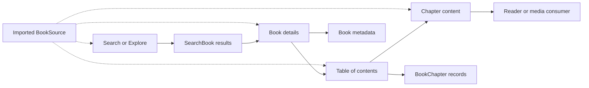
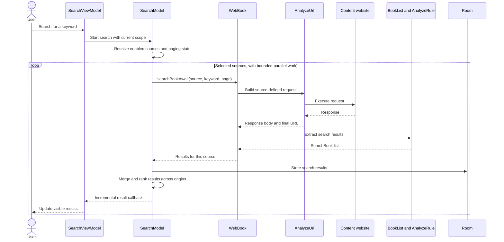
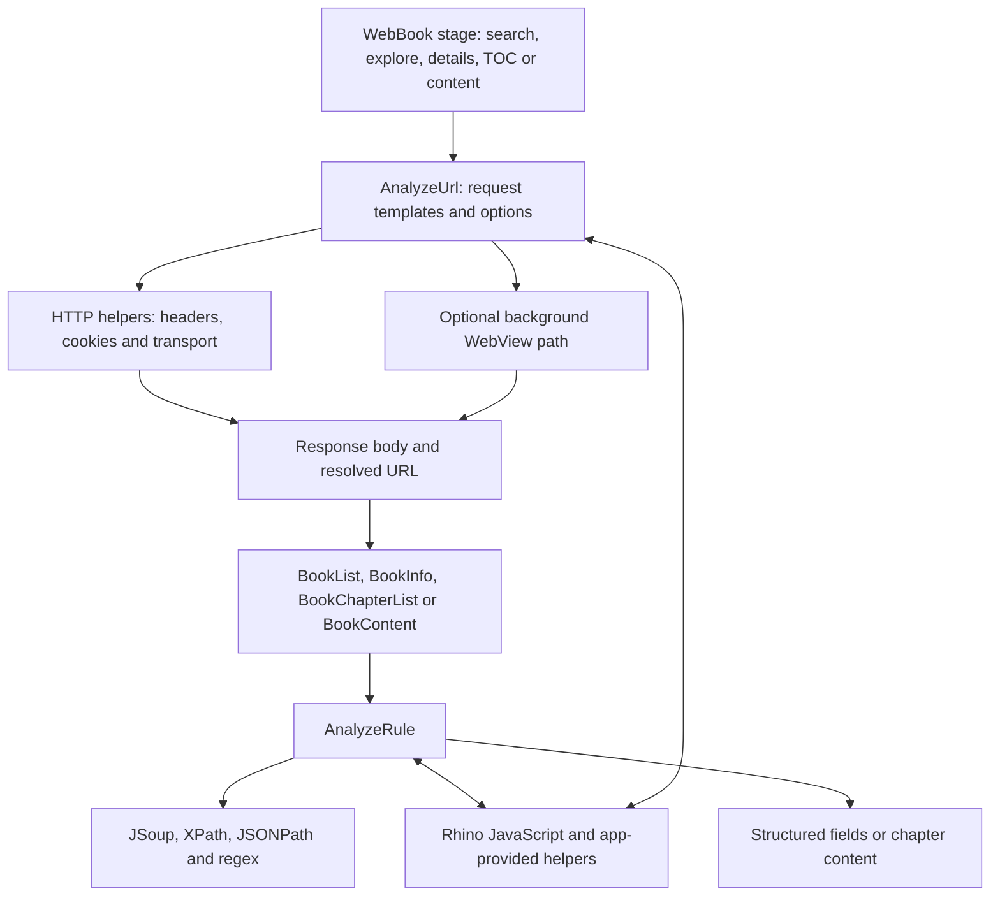
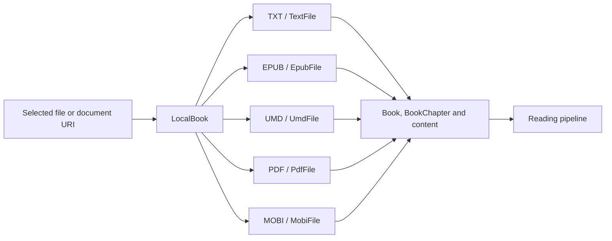

# Content sources: from a rule or file to chapters

[Architecture overview](README.md) | Next: [Reader](reader.md)

## 1. The core mental model

A **book source** is configuration describing how to request and interpret a
website. It is not the book itself, a server run by HunReader, or a compiled
plugin. A source can supply text, audio, images, downloadable files or video.

[BookSource](../app/src/main/java/io/legado/app/data/entities/BookSource.kt)
contains its identity, enabled flags, headers, login behavior, JavaScript
library, search/explore URLs and rules for each extraction stage.

The stages are not necessarily separate HTTP requests: previously obtained HTML
may be reused. Content may also span several web pages.

| Concept | Meaning |
| --- | --- |
| `BookSource.bookSourceUrl` | Source identity and request base context |
| `SearchBook` | Search result, including candidate origins; not automatically a shelf entry |
| `Book.bookUrl` | Book identity; a remote details URL or local-file identity |
| `Book.origin` | Remote source identity, or a local-book marker |
| `Book.tocUrl` | Table-of-contents location |
| `BookChapter` | Chapter metadata, order and location; not the full chapter text |

Sources are imported or edited through the
[association dialogs](../app/src/main/java/io/legado/app/ui/association) and
[source management UI](../app/src/main/java/io/legado/app/ui/book/source).
HunReader does not populate an online book-source catalog on first launch.

## 2. Searching multiple sources

[SearchViewModel](../app/src/main/java/io/legado/app/ui/book/search/SearchViewModel.kt)
owns screen state and delegates searching to
[SearchModel](../app/src/main/java/io/legado/app/model/webBook/SearchModel.kt).
The latter handles source selection, concurrency, pagination, pause/cancel and
merging. It applies a 30-second timeout around each source search. Results with
matching name and author can be merged while retaining multiple origins.

Selecting a result leads to the
[book details UI](../app/src/main/java/io/legado/app/ui/book/info).
[BookInfoViewModel](../app/src/main/java/io/legado/app/ui/book/info/BookInfoViewModel.kt)
coordinates metadata, chapter loading and saving. Persisting a book for opening
or previewing it is not the same user action as adding it to the bookshelf.

## 3. The reusable rule engine

- [WebBook](../app/src/main/java/io/legado/app/model/webBook/WebBook.kt) orchestrates
  requests, optional login-check scripts and stage-specific parsing.
- [AnalyzeUrl](../app/src/main/java/io/legado/app/model/analyzeRule/AnalyzeUrl.kt)
  interprets request expressions, keyword/page substitutions and request options.
  Some sources need a WebView; this is not the normal text-reader renderer.
- [AnalyzeRule](../app/src/main/java/io/legado/app/model/analyzeRule/AnalyzeRule.kt)
  interprets extraction expressions. Rule modes and JavaScript can be combined;
  this is not one universal CSS selector.
- [Stage parsers](../app/src/main/java/io/legado/app/model/webBook) turn extracted
  fields into application objects.
- [BookContent](../app/src/main/java/io/legado/app/model/webBook/BookContent.kt)
  follows content-pagination rules and normally saves parsed content through
  [BookHelp](../app/src/main/java/io/legado/app/help/book/BookHelp.kt).
  An empty content rule can instead make the chapter URL itself the result,
  useful when the consumer needs a resource rather than extracted prose.

**Two meanings of page:** source pagination is about HTTP result/content pages;
reader pagination is about fitting text on the device screen. They happen in
different layers.

Imported rules can contain JavaScript and perform requests using application
helpers. Treat them as active configuration from a trusted author, not inert
book metadata. Do not put credentials in shared sample rules or public logs.

## 4. Local books converge on the same reader

[LocalBook](../app/src/main/java/io/legado/app/model/localBook/LocalBook.kt)
dispatches to format-specific handlers for chapter lists and content. It also
handles file access, archive import and recovery/download of supported remote
files. Supported formats do not imply identical layout fidelity or navigation.

TXT needs chapter-boundary rules and encoding handling; EPUB has its own
navigation and resources. The [local-book package](../app/src/main/java/io/legado/app/model/localBook)
adapts these differences. EPUB and UMD helpers live in
[the book library](../modules/book); PDF and MOBI are not implemented there.

Once a chapter is available, the [reader pipeline](reader.md) consumes it through
the same book/chapter abstractions. Local reading does not require an online
book source.

## 5. Trace a feature or diagnose it

| Symptom or change | First place to inspect |
| --- | --- |
| No sources searched | Search scope and source enabled flags in `SearchModel` |
| Request URL, headers, cookies or login are wrong | `AnalyzeUrl`, `WebBook` and [HTTP helpers](../app/src/main/java/io/legado/app/help/http) |
| HTML arrives but fields are empty | Stage parser, `AnalyzeRule` and the source's specific rule |
| TOC works but a chapter is incomplete | `BookContent` and content-pagination rules |
| Local book missing or unreadable | URI access and format dispatch in `LocalBook` |
| Content is correct but screen text looks wrong | [Processing and layout](reader.md), not necessarily source extraction |

**Reading exercise:** start at `SearchViewModel.search`, follow
`SearchModel.startSearch` into `WebBook.searchBookAwait`, and stop when the
`SearchBook` list returns. Then trace a single chapter separately. This keeps
request construction, extraction and rendering from becoming one confusing path.

For syntax details, use the existing
[source rules](../app/src/main/assets/web/help/md/ruleHelp.md),
[JavaScript helpers](../app/src/main/assets/web/help/md/jsHelp.md),
[source debugging help](../app/src/main/assets/web/help/md/debugHelp.md) and
[TXT chapter rules](../app/src/main/assets/web/help/md/txtTocRuleHelp.md).
