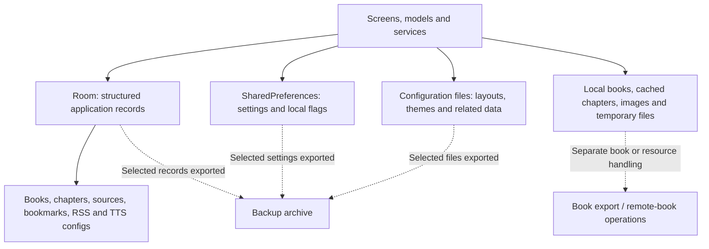
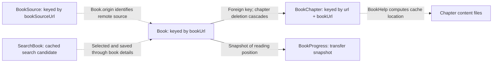
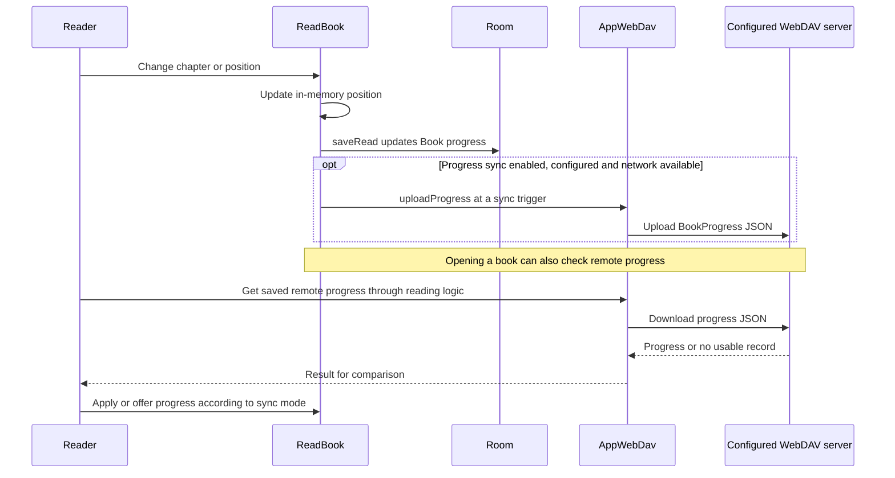
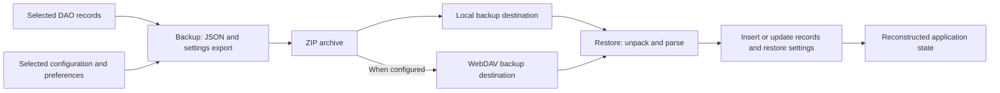

# Data, reading progress, backup and sync

[Architecture overview](README.md) | [Reader](reader.md) |
[Integrations](integrations.md)

## 1. There is more than one kind of storage

[AppDatabase](../app/src/main/java/io/legado/app/data/AppDatabase.kt) creates the
global lazy `appDb` Room instance, backed by `legado.db`. The current schema
version is 89. [DAOs](../app/src/main/java/io/legado/app/data/dao) define queries;
[entities](../app/src/main/java/io/legado/app/data/entities) define stored objects.

Room is **not the complete book-content store**. Chapters are metadata records;
downloaded text is normally stored through
[BookHelp](../app/src/main/java/io/legado/app/help/book/BookHelp.kt) in files.
Imported books also depend on their underlying files/document URIs.
Deleting caches and deleting books are not equivalent actions.

[AppConfig](../app/src/main/java/io/legado/app/help/config/AppConfig.kt),
[LocalConfig](../app/src/main/java/io/legado/app/help/config/LocalConfig.kt) and
[ReadBookConfig](../app/src/main/java/io/legado/app/help/config/ReadBookConfig.kt)
cover different settings/state surfaces. Not every setting is a Room column.

## 2. Core records and identities

Only the book-to-chapter arrow above represents a declared foreign key.
The other edges are logical associations, not a complete database ER diagram.

- [Book](../app/src/main/java/io/legado/app/data/entities/Book.kt) also has a unique
  name/author index. Source changes and imports must respect both this and the
  primary key.
- [BookChapter](../app/src/main/java/io/legado/app/data/entities/BookChapter.kt)
  has a unique book URL/chapter-index constraint in addition to its primary key.
- `Book.origin` uses a local marker for local books rather than a remote source.
- [BookProgress](../app/src/main/java/io/legado/app/data/entities/BookProgress.kt)
  is a progress-transfer object, not a table listed in the Room database.

Other important groups include bookmarks/read records, book groups,
replacement/TXT chapter rules, RSS articles/stars/read records, HTTP TTS
configurations, cookies and cached values.

## 3. Local progress and WebDAV progress are separate

[ReadBook.saveRead](../app/src/main/java/io/legado/app/model/ReadBook.kt)
updates the book's chapter index, in-chapter position, title and reading time.
It is not itself a network upload.
[AppWebDav](../app/src/main/java/io/legado/app/help/AppWebDav.kt) handles remote
progress separately. Files under `bookProgress` are named from normalized book
name and author, rather than a device's local file path or a source URL.

Do not assume universal last-write-wins behavior:

- Startup bulk sync checks remote modification time against `syncTime` and only
  advances a book when the remote chapter/position is farther ahead.
- Reader opening uses
  [ReadBookViewModel](../app/src/main/java/io/legado/app/ui/book/read/ReadBookViewModel.kt)
  and, for enhanced sync, `ReadBook.syncProgress`. Comparison, application and
  prompting vary by the path and settings.
- Syncing progress does not transfer a book file or guarantee that another
  source has an identical chapter list.

WebDAV requires an explicit endpoint and credentials. The default subdirectory
is `hunreader`; it is not a built-in cloud account.

## 4. Backup/restore is an export/import workflow

[Backup](../app/src/main/java/io/legado/app/help/storage/Backup.kt) exports a
specific list of records and configuration files, then creates a ZIP. It is not
a raw copy of `legado.db`, all caches or every imported book.
[Restore](../app/src/main/java/io/legado/app/help/storage/Restore.kt) unpacks the
archive and inserts/updates the supported data; it is not simply replacing the
whole database file. Restore options can affect local-book handling.

Keep these three workflows distinct:

| Workflow | What it transfers |
| --- | --- |
| Application backup | Selected bookshelf metadata, rules, settings, bookmarks and other exported records |
| Progress sync | Small per-book reading-position snapshots |
| Book export / remote books | Actual book files through separate operations |

Android automatic cloud backup is disabled in the manifest. This does **not**
remove the application's own backup logic: manual local/WebDAV operations remain,
and release `MainActivity.onDestroy` calls `Backup.autoBack`, which applies its
own timing checks. Checking for a newer remote backup on startup is separately
controlled by configuration.

Treat backups and exported configurations as sensitive: source headers, TTS
settings and other configuration may contain credentials. Do not assume a backup
is a complete, portable copy of local books or their document permissions.

## 5. Changing the data model safely

Read [DatabaseMigrations](../app/src/main/java/io/legado/app/data/DatabaseMigrations.kt)
and the exported [Room schemas](../app/schemas) alongside an entity change.
Auto-migrations and explicit migrations coexist. The database builder also
permits main-thread queries, so a clean architecture diagram should not be read
as a threading guarantee.

**Reading exercise:** pick one setting or book field and find all four surfaces:
its storage definition, UI/editor, consumers and backup/restore representation.
For a progress field, also inspect its transfer representation.

[MigrationTest](../app/src/androidTest/java/io/legado/app/MigrationTest.kt) is the
starting point for database migration checks. Use
[DEVELOPING](../DEVELOPING.md) for the existing test commands rather than
inventing a separate test toolchain.
