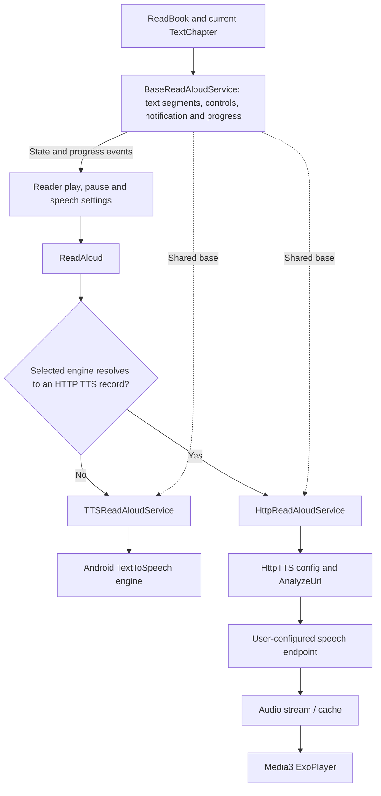
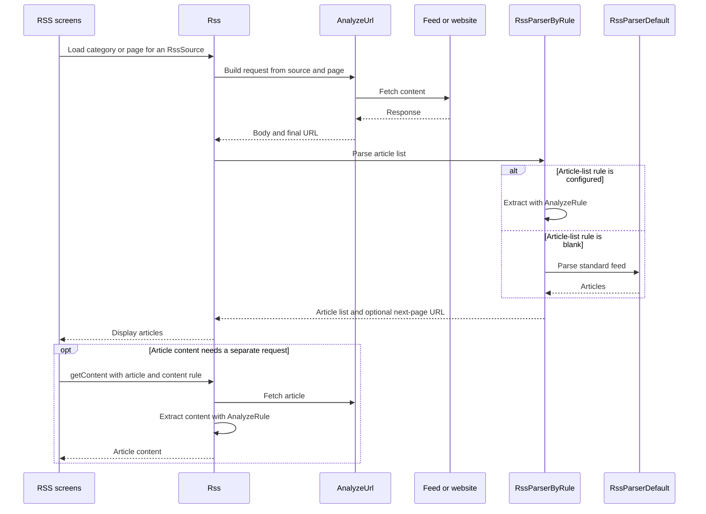
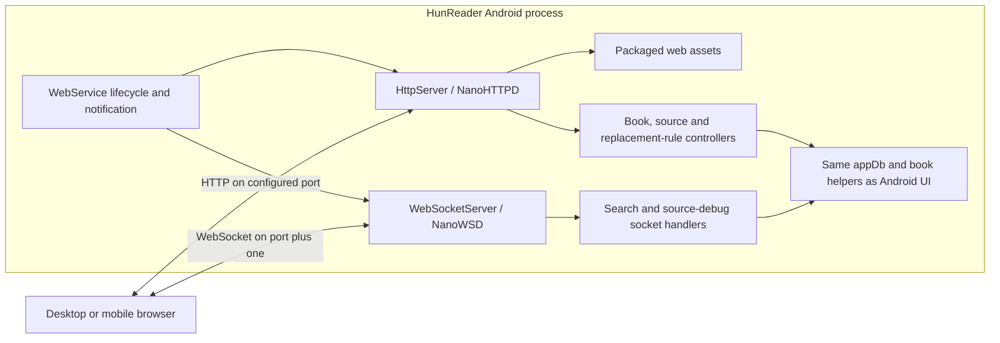

# Integrations: speech, media, RSS and the web interface

[Architecture overview](README.md) | [Reader](reader.md) |
[Data and sync](data-and-sync.md)

These features reuse the content, configuration and storage layers, but they are
not all part of the text-reader rendering loop.

## 1. Read-aloud: two engines behind a shared service contract

[ReadAloud](../app/src/main/java/io/legado/app/model/ReadAloud.kt) resolves a
per-book or global engine choice and sends service commands. A numeric choice
that resolves to a stored HTTP TTS record selects the HTTP service; other choices
use system TTS.

[BaseReadAloudService](../app/src/main/java/io/legado/app/service/BaseReadAloudService.kt)
provides shared playback state, text segmentation, media controls, notifications,
timer behavior and progress events. It reads the current chapter from `ReadBook`.
This lets speech continue beyond the reader screen's immediate UI lifecycle.

| Path | Implementation | Main boundary |
| --- | --- | --- |
| System speech | [TTSReadAloudService](../app/src/main/java/io/legado/app/service/TTSReadAloudService.kt) | Android `TextToSpeech`; actual voices/connectivity depend on the installed engine |
| HTTP speech | [HttpReadAloudService](../app/src/main/java/io/legado/app/service/HttpReadAloudService.kt) | Configured request produces audio played through ExoPlayer |
| Engine configuration | [HttpTTS entity](../app/src/main/java/io/legado/app/data/entities/HttpTTS.kt) | User-supplied URL/rules and related settings |

The HTTP service uses `AnalyzeUrl` with speech text and speed, supports a
login-check script and checks the returned content type before using audio.
This is not a hard-coded Azure SDK integration: Azure/Foundry-backed TTS is one
possible user configuration. HunReader provides no bundled HTTP TTS entries or
credentials. See [HTTP TTS rule help](../app/src/main/assets/web/help/md/httpTTSHelp.md).

Progress/state events connect speech back to the reader. When changing text
processing or segmentation, check both spoken text and visible position/highlight
behavior, not just whether audio plays.

### Speech is not source-provided audio

[AudioPlay](../app/src/main/java/io/legado/app/model/AudioPlay.kt) and
[AudioPlayService](../app/src/main/java/io/legado/app/service/AudioPlayService.kt)
handle source audio. [VideoPlay](../app/src/main/java/io/legado/app/model/VideoPlay.kt)
and [VideoPlayService](../app/src/main/java/io/legado/app/service/VideoPlayService.kt)
handle video. [ReadManga](../app/src/main/java/io/legado/app/model/ReadManga.kt)
coordinates image reading. A chapter/resource URL from a source may feed these
consumers instead of becoming text for TTS.

## 2. RSS: a parallel use of source rules

[Rss](../app/src/main/java/io/legado/app/model/rss/Rss.kt) reuses request/rule
infrastructure, including source login-check behavior.
[RssParserByRule](../app/src/main/java/io/legado/app/model/rss/RssParserByRule.kt)
uses custom rules when present and falls back to
[RssParserDefault](../app/src/main/java/io/legado/app/model/rss/RssParserDefault.kt)
for a blank article-list rule.

The [RSS screens](../app/src/main/java/io/legado/app/ui/rss) and
[main RSS tab](../app/src/main/java/io/legado/app/ui/main/rss)
work with RSS-specific sources, articles, stars and read records in Room.
These are not book chapters disguised as feed entries.
See [RSS rule help](../app/src/main/assets/web/help/md/rssRuleHelp.md).

## 3. Optional web service: the phone is the backend

[WebService](../app/src/main/java/io/legado/app/service/WebService.kt) starts and
stops both servers and reports the phone's reachable addresses. It is optional
and off by default. The implementation's default HTTP port is **1122**, with
WebSocket on **1123**; a configured port changes both. Older API examples using
1234 are examples, not the implementation default.

[HttpServer](../app/src/main/java/io/legado/app/web/HttpServer.kt) serves assets
and dispatches requests to [controllers](../app/src/main/java/io/legado/app/api/controller).
For example, `GET /getBookshelf` queries books and
`POST /saveBookProgress` delegates a progress update.
[WebSocketServer](../app/src/main/java/io/legado/app/web/WebSocketServer.kt)
routes `/bookSourceDebug`, `/rssSourceDebug` and `/searchBook` connections.

This is not a separate cloud backend. The phone must be running the service and
be reachable by the browser. Keep it on trusted networks; do not assume enabling
it is equivalent to deploying a hardened public server.

### Web client packaging

[modules/web](../modules/web) contains Vue 3/TypeScript source with Vite and pnpm
scripts. Android serves files from
[app assets](../app/src/main/assets/web), including the packaged Vue client.
Changing Vue source alone does not change the files in an APK.

The [web build script](../modules/web/package.json) runs type-check/build and then
[sync.js](../modules/web/scripts/sync.js). The sync script copies output into
Android assets **only when `GITHUB_ENV` is set**; normal local execution skips
that copy. The [web workflow](../.github/workflows/web.yml) supplies this CI
environment. Account for the asset-copy step when developing locally rather than
assuming a Gradle build compiles Vue or a local web build updates APK assets.

## 4. Android integration boundaries

- [API status](../api.md) distinguishes the enabled optional web API from the
  disabled external ReaderProvider. Retained provider documentation does not
  make that provider available in this fork.
- The [manifest](../app/src/main/AndroidManifest.xml) registers
  `hunreader://` / `hunreader-debug://` through build placeholders for imports.
  It does not register the upstream app's URI schemes.
- FileProvider remains for user-initiated sharing with authority
  `${applicationId}.fileProvider`.
- Dictionary handoff uses Android text processing; see
  [the reader sequence](reader.md#4-selection-and-dictionary-handoff).

**Reading exercise:** trace `ReadAloud.play` into one service, then separately
trace `GET /getBookshelf` from `HttpServer` into `BookController`. Notice that
both reuse application state without going through `MainActivity`.

For validation entry points, inspect
[HttpTtsTest](../app/src/androidTest/java/io/legado/app/HttpTtsTest.kt),
[HunReaderConfigurationTest](../app/src/test/java/io/legado/app/HunReaderConfigurationTest.kt)
and the [device smoke checks](../DEVELOPING.md#9-run-device-tests).
Read test setup before running network-dependent checks; never add real
credentials to test source.
