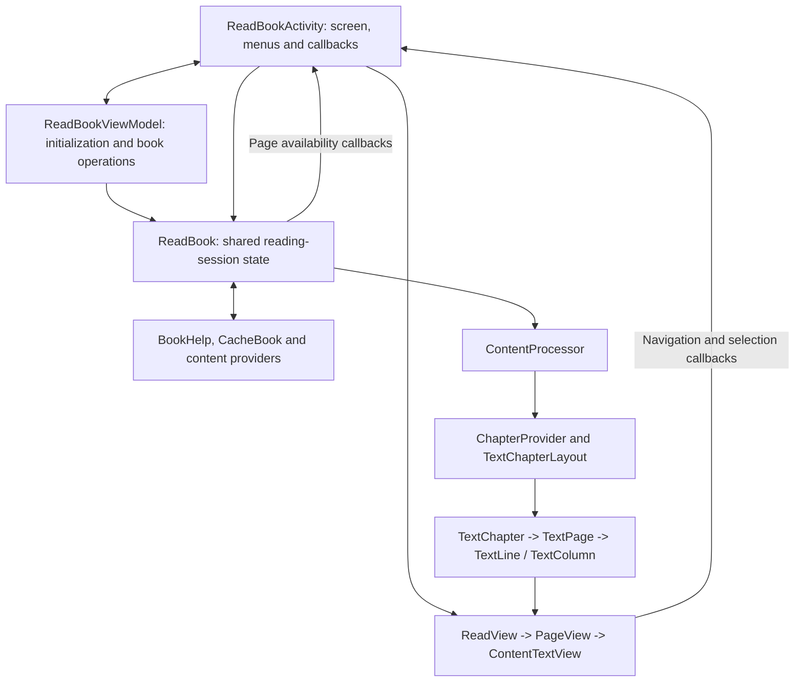
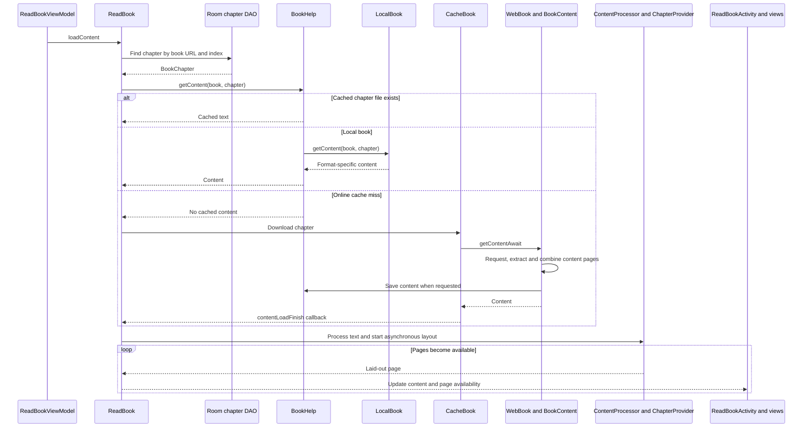
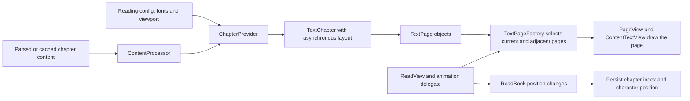
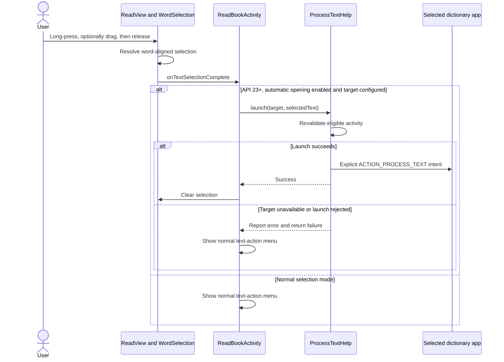

# Reader: from chapter content to an interactive page

[Architecture overview](README.md) | [Content sources](content-sources.md) |
[Data and sync](data-and-sync.md)

This guide follows the **text reader**. Manga, source audio/video and RSS have
their own presentation paths; see [Integrations](integrations.md).

## 1. Who owns what?

| Component | Responsibility |
| --- | --- |
| [ReadBookActivity](../app/src/main/java/io/legado/app/ui/book/read/ReadBookActivity.kt) | Screen lifecycle, controls, configuration, callbacks and text actions |
| [ReadBookViewModel](../app/src/main/java/io/legado/app/ui/book/read/ReadBookViewModel.kt) | Resolve the requested book, load metadata/TOC, change sources and coordinate sync |
| [ReadBook](../app/src/main/java/io/legado/app/model/ReadBook.kt) | Current book/source, chapter and position, neighboring chapters, loading and progress |
| [ContentProcessor](../app/src/main/java/io/legado/app/help/book/ContentProcessor.kt) | Display-time replacements, title handling and configured Chinese conversion |
| [ChapterProvider](../app/src/main/java/io/legado/app/ui/book/read/page/provider/ChapterProvider.kt) | Fonts, paints, available dimensions and creation of laid-out chapters |
| [TextChapterLayout](../app/src/main/java/io/legado/app/ui/book/read/page/provider/TextChapterLayout.kt) | Turn chapter content into pages and lines, including image/HTML-aware cases |
| [Reader views](../app/src/main/java/io/legado/app/ui/book/read/page) | Draw pages, interpret gestures and coordinate page animations |

`ReadBook` is an application-level Kotlin object, not a screen-local ViewModel.
Services such as read-aloud also use it. Lifecycle, cancellation and callback
registration matter when changing the reader.

## 2. Opening a book and obtaining content

The ViewModel resolves a book from the intent or last-read state, initializes
`ReadBook`, checks local-file access when applicable and ensures chapters exist.
Online details/TOC come from `WebBook`; local chapters come from `LocalBook`.
Missing data and permission failures have UI/error paths.

The following shows one successful text-chapter load after initialization:

[BookHelp.getContent](../app/src/main/java/io/legado/app/help/book/BookHelp.kt)
checks the chapter file cache before calling the local parser.
[CacheBook](../app/src/main/java/io/legado/app/model/CacheBook.kt) coordinates
online downloads. Bulk offline caching also uses it through
[CacheBookService](../app/src/main/java/io/legado/app/service/CacheBookService.kt).

The reader loads the current, next and previous chapters. Configured
pre-download can fetch additional chapters without laying out all of them.
Network download, file caching and layout are separate operations.

## 3. Pagination and rendering

The [page entities](../app/src/main/java/io/legado/app/ui/book/read/page/entities)
are a display model, distinct from Room's `BookChapter`. A database chapter does
not have a stable count of screen pages: changing font size, spacing, orientation
or viewport can change pagination.

[TextPageFactory](../app/src/main/java/io/legado/app/ui/book/read/page/provider/TextPageFactory.kt)
selects neighboring pages/chapters.
[ReadView](../app/src/main/java/io/legado/app/ui/book/read/page/ReadView.kt)
owns the page views and chooses the
[animation delegate](../app/src/main/java/io/legado/app/ui/book/read/page/delegate).
[ContentTextView](../app/src/main/java/io/legado/app/ui/book/read/page/ContentTextView.kt)
draws content. The normal reader is not a WebView displaying an entire website.

`ReadBook.contentLoadFinish` processes content and consumes the chapter's layout
channel, updating the screen as pages become ready. This is why a layout change
must preserve reading position and handle work already in progress.

Persisted progress uses a chapter index and in-chapter character position rather
than a permanent screen page number. See [Data and sync](data-and-sync.md).

## 4. Selection and dictionary handoff

[WordSelection](../app/src/main/java/io/legado/app/ui/book/read/page/WordSelection.kt)
supports whole-word long-press dragging. The separate handles remain
character-precise. Gesture handling must distinguish selection from page turns;
[PageTurnGesture](../app/src/main/java/io/legado/app/ui/book/read/page/PageTurnGesture.kt)
is part of that behavior.

The external-app feature is opt-in through
[reading settings](../app/src/main/java/io/legado/app/ui/book/read/config/MoreConfigDialog.kt).
[ProcessTextHelp](../app/src/main/java/io/legado/app/help/ProcessTextHelp.kt)
discovers eligible Android text-processing activities and launches the chosen
component with read-only text. It is not a proprietary dictionary API.
The normal [TextActionMenu](../app/src/main/java/io/legado/app/ui/book/read/TextActionMenu.kt)
also offers built-in actions; built-in dictionary rules are a separate mechanism.

## 5. A practical code-reading and testing route

1. Follow `ReadBookViewModel.initData` to `initBook`.
2. Follow `ReadBook.loadContent` through a cache hit before studying downloads.
3. Follow `contentLoadFinish` into `ChapterProvider.getTextChapterAsync`.
4. Compare the persisted `BookChapter` with an in-memory `TextChapter`.
5. Follow one page turn and then a text-selection completion callback.

Useful existing checks:

- [WordSelectionTest](../app/src/test/java/io/legado/app/ui/book/read/page/WordSelectionTest.kt)
  and [PageTurnGestureTest](../app/src/test/java/io/legado/app/ui/book/read/page/PageTurnGestureTest.kt)
  cover focused JVM behavior.
- [TextSelectionAppDeviceTest](../app/src/androidTest/java/io/legado/app/TextSelectionAppDeviceTest.kt)
  covers Android integration.
- [Development regression checks](../DEVELOPING.md#9-run-device-tests)
  describe selection, gesture and TTS checks on a device.

When debugging, first decide whether the defect is **content acquisition,
content transformation, layout, rendering or input handling**. The same visible
symptom can originate in very different parts of this pipeline.
